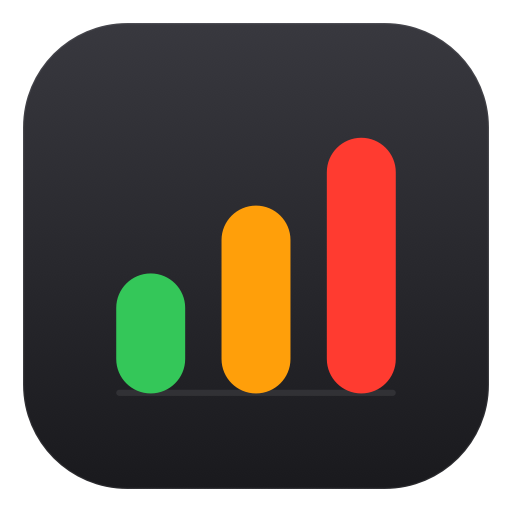
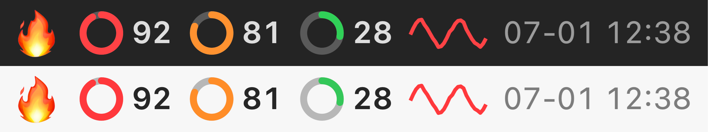

# macstatus



原生 macOS 菜单栏（menu bar）系统监控小工具。用三个环形仪表 + CPU 走势图，在状态栏实时显示 CPU 占用、内存占用、磁盘剩余，并带状态表情与北京时间：



| 指标 | 含义 | 说明 |
| --- | --- | --- |
| `CPU` | CPU 占用百分比 | 已使用（user + system + nice）/ 总时间，与 `top` 的 busy 口径一致 |
| `MEM` | 内存占用百分比 | 已用 = App 内存 + 联动(wired) + 压缩，与「活动监视器」口径一致 |
| `DISK` | 磁盘**剩余**百分比 | 真实可用空间 / 总容量，与 `df` 一致（不含可清除空间） |

三个环形仪表依次是 CPU / 内存 / 磁盘剩余，环的填充即百分比、按阈值变色，末尾一条是 CPU 走势线（sparkline）。图形在深色 / 浅色菜单栏均自动适配。

- CPU / 内存环 ≥ 75% 橙、≥ 90% 红；磁盘剩余环 ≤ 20% 橙、≤ 10% 红。
- 末尾 CPU 走势 sparkline，直观看出「持续忙」还是「刚抖一下」。
- 左侧小表情显示机器整体状态，CPU 过高时变成跳动的小火苗 🔥。
- 尾部显示**北京时间** `月-日 时:分`（固定 `Asia/Shanghai`，不随系统时区变化）。
- 点击图标看带 GB 数值的下拉详情（含完整 `年-月-日` 北京时间）；悬停看完整数值。
- 可切换刷新间隔（1/2/3/5 秒）并记忆；另有「动画效果」「开机自动启动」开关。

## 状态表情

数字左边的小表情按 CPU 负载反映机器「心情」。**忙时才动、闲时静止省电**（静态态无额外唤醒），可在菜单「动画效果」里随时关闭。


| 状态 | 表情 | 触发 | 动画 |
| --- | --- | --- | --- |
| 休息 | 😴 | CPU < 8% | 静止 |
| 清闲 | 😌 | 8–25% | 静止 |
| 工作中 | 🙂 | 25–60% | 静止 |
| 繁忙 | 😤 | 60–85% | 轻微脉动 |
| 火力全开 | 🔥 | ≥ 85%（或内存 ≥ 95%） | 跳动闪烁 |

## 环境要求

- macOS 13 及以上
- Swift 6 工具链（随 Xcode 提供）

## 开发运行

```bash
swift run                 # 直接以菜单栏程序运行（Ctrl-C 退出）
swift run macstatus --once  # 诊断模式：采样一次打印到终端后退出
```

## 打包与安装

```bash
./scripts/build_app.sh    # 产物：dist/macstatus.app
open dist/macstatus.app   # 启动（无 Dock 图标，仅菜单栏）
```

打包发布用的 DMG（arm64，含「拖拽到 Applications」安装）：

```bash
./scripts/make_dmg.sh     # 产物：dist/macstatus-<版本>-arm64.dmg
```

如需开机自启：把 `dist/macstatus.app` 拖入「系统设置 → 通用 → 登录项」，或用菜单里的「开机自动启动」开关。

> 应用为本地 ad-hoc 签名、未经 Apple 公证。从网络下载的版本首次打开若被 Gatekeeper 拦截，右键 →「打开」一次即可，或执行 `xattr -dr com.apple.quarantine macstatus.app`。

图标由 `swift scripts/make_icon.swift` 渲染各尺寸 PNG，再用 `iconutil` 合成 `assets/AppIcon.icns`。

## 指标实现

- **CPU** — `host_statistics(HOST_CPU_LOAD_INFO)`，对两次采样的 tick 差值计算占用率。
- **内存** — `host_statistics64(HOST_VM_INFO64)`，`已用 = (internal - purgeable + wired + compressed) × 页大小`。
- **磁盘** — `statfs("/")`，`剩余 = f_bavail × f_bsize / (f_blocks × f_bsize)`。

## 项目结构

```
Sources/macstatus/
  main.swift            # 入口；accessory 策略 + --once / --faces / --bar 诊断
  SystemMonitor.swift   # CPU / 内存 / 磁盘 采样
  Clock.swift           # 北京时间（Asia/Shanghai）格式化
  StateFace.swift       # 状态判定与表情动画帧
  BarRenderer.swift     # 状态栏图形合成：环形仪表 + sparkline + 表情
  AppDelegate.swift     # NSStatusItem、定时刷新、下拉菜单、动画、开机自启
scripts/build_app.sh    # 编译并打包为 .app（含图标）
scripts/make_dmg.sh     # 打包 arm64 DMG（拖拽到 Applications）
scripts/make_icon.swift # 渲染 .icns 图标与 logo.png
assets/                 # AppIcon.icns、logo.png、screenshot.png、faces.png
```

## 许可

[MIT](LICENSE) © 2026 [uk0](https://github.com/uk0)

## 作者

[github.com/uk0](https://github.com/uk0)
